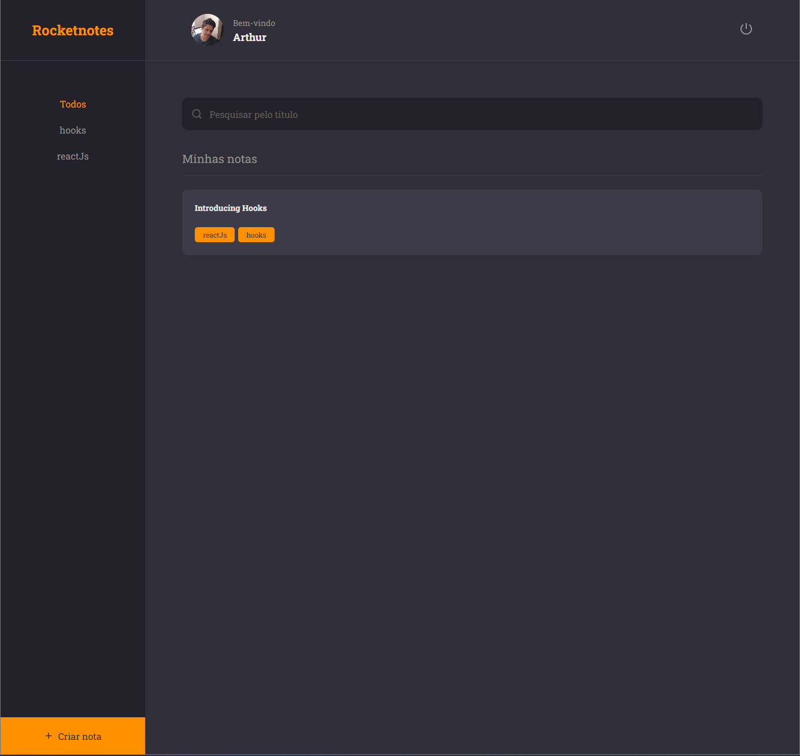

<h1 align="center">
 Rocket Notes
</h1>

<p align="center">Application to save and manage your useful links</p>

<p align="center">
  

  <a href="https://www.linkedin.com/in/arks-lacerda/">
    
  </a>
  
  
  
  <a href="https://github.com/arks-lacerda/rocketnotes">
    
  </a>

  
</p>

---

<div align="center">

 
</div>

## 👨🏻‍💻 About Project Layout

[Figma link](<https://www.figma.com/file/FNn5vXTQ4NUenaDBUuYqNr/RocketNotes-(Copy)?node-id=0%3A1&mode=dev>)

## 🚀 Technologies

Technologies that I used to develop this web client

- [ReactJS](https://reactjs.org/)
- [React Router DOM](https://reacttraining.com/react-router/)
- [React Icons](https://react-icons.netlify.com/#/)
- [Styled Components](https://styled-components.com/)
- [Prettier](https://prettier.io/)

## 💻 Getting started

### Requirements

**Clone the project and access the folder**

```bash
$ git clone https://github.com/arks-lacerda/rocketnotes.git && cd rocketnotes
```

**Follow the steps below**

```bash
# Install the dependencies
$ npm install

# Start the client
$ npm start
```

## 📝 License

This project is under the [MIT]() license. See the LICENSE file for more details.

</div>

<div id="MyLinkedIn">

## 🔎 My LinkedIn

<a href="https://www.linkedin.com/in/arks-lacerda/"></a>

<h3 align="center">Developed by Arthur Lacerda ☕</h3>
</div>
